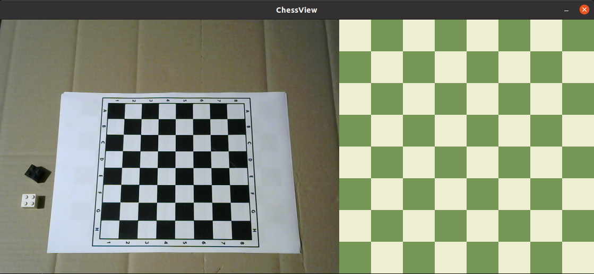

# ChessView - OBS Studio plugin

## Table of contents
* [General info](#general-info)
* [Technologies](#technologies)
* [Install](#Install)
* [Hardware](#hardware)
* [Dataset](#dataset)
* [Board recognition](#board-recognition)
* [Pieces recognition](#pieces-recognition)
* [Summary](#summary)

## General info

Chessboard state recognition for Chess IRL stream. Plugin translates pieces positions to 2d board view.

## Technologies

* Python
* C++
* Tensorflow
* OBS Studio

## Hardware

* Logitech C270

## Install

## Dataset

## Board Recognition

## Piece Recognition

## Summary
